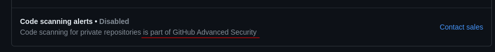
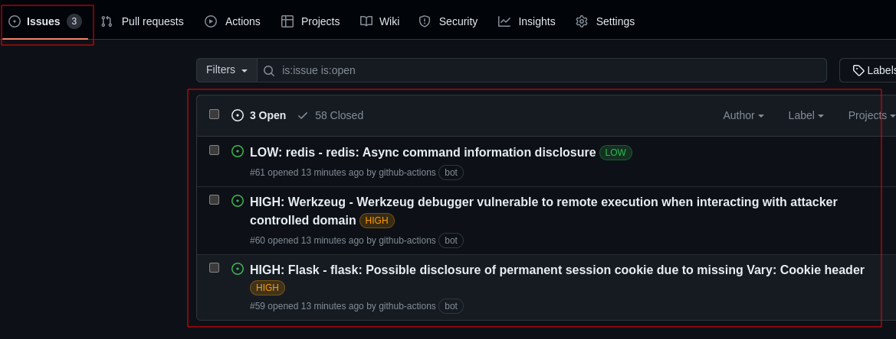

## SUPPORT RS - BRAZIL
{width=230 height=150}
The southern region of Brazil is being heavily affected by flooding. Almost 70% of the municipalities in Rio Grande do Sul have been hit by floods and more than 120,000 people are currently unsheltered.
Please, if possible, make a donation in the Vakinha that I'm making available below. This Vakinha has no connection with the government and all the money will go to those who really need it
https://vakinha.com.br/vaquinha/a-maior-campanha-solidaria-do-rs
💚❤️💛

# Trivy Scan and Open Issues

This GitHub Action integrates Trivy vulnerability scanning into your workflow. It scans the filesystem for vulnerabilities based on the severity levels you specify and opens GitHub issues for any vulnerabilities found.

## When to use this Action?
If you use any version of Github Enterprise and want to take advantage of Aquasecurity's Trivy, you need to have the additional Github Code Scanning license to be able to generate the items in the "Security" tab

With this Action, you can bypass the need to purchase Code Scanning if your company can't for some reason, so we've created issues for each of the vulnerabilities pointed out by Trivy

## Necessary settings
It is mandatory to use "issues: write" in your job that will be calling this action, in addition to passing the Github Token generated at runtime. 
Minimal requiriments example:

    jobs:
      scan:
        permissions:
	        issues: write
    name: scan
    runs-on: ubuntu-20.04
    steps:
	- name: Checkout code
	uses: actions/checkout@v3
 
	- name: Trivy Scan
    uses: FabioBartoli/trivy-open-issues@v1.0.0
    with:
      github_token: ${{ github.token }}

## Inputs
Below are all the parameters you can modify in your pipeline to use this Action

| Name                         | Default                            | Description                                                                                                                                                    |
|------------------------------|------------------------------------|----------------------------------------------------------------------------------------------------------------------------------------------------------------|
| `github_token`                  | `none`                            | Token used to manage the repository where issues will be created                                                                                                                                |
| `severity`                      | `'MEDIUM,CRITICAL,HIGH'`                                   | Severity levels to check for vulnerabilities                                                                                                                        |
| `ignore-unfixed`                  |         true                           | Image Defines whether unfixed vulnerabilities should be ignored                                                                                                                         |
| `skip-dirs`                   | `""`               | Comma separated list of directories where traversal is skipped                                                                                                              |
| `skip-files`                     | `""`                            | Comma separated list of files where traversal is skipped                                                                                                             |
                                                                                                                           
## Example of using all possible variables
Below is an example of how to use each of the above input variables in your code:

    name: scan
	on:
	  push:
	    branches:
	    - main

	jobs:
	  scan:
	    permissions:
	      issues: write
	    name: scan
	    runs-on: ubuntu-20.04
	    steps:
	    - name: Checkout code
	      uses: actions/checkout@v3

	    - name: Trivy Scan
	      uses: FabioBartoli/trivy-open-issues@v1.0.0
	      with:
	        github_token: ${{ github.token }}
	        severity: "LOW,HIGH,CRITICAL"
	        skip-dirs: "./images,./static"
	        ignore-unfixed: false
	        skip-files: "./redis.conf,./README.md"

## Final Notes
We hope to soon be able to add the functionality of also reading Docker Images
**For contributors:** Feel free to fork the code and suggest any changes via Pull Requests in this repository 😀
## Contact
If you have any questions or suggestions, please contact us via [LinkedIn](https://www.linkedin.com/in/fabiobartoli/) or [Telegram](https://t.me/FabioBartoli) 